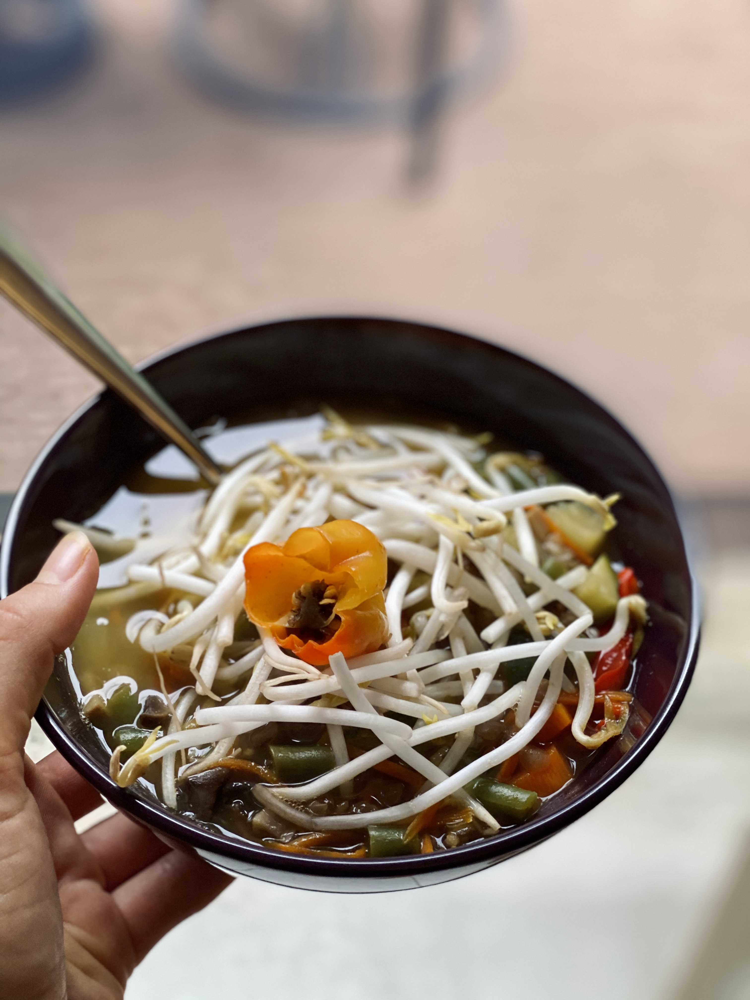

 

 

If there’s one thing you really need to know about me, it’s my undying love for soup. 
 

Seriously…

 

I’m **OBSESSED!**

 

Soup is always exactly what I need, even when I don’t know its what I need.

 

Soup is an excellent way to get a good healthy dose of nutrients, and minerals by throwing in so many veggies, you completely lose track. 

 

- - -

 

Today’s Recipe is called **EVERYTHING BUT THE KITCHEN SINK SOUP** for a few reasons…

 

- - -

 

1. **It is an excellent way to use up all of your leftover produce!**
    

   We all have bigger eyes than stomachs, and I tend to overbuy produce all at once and struggle to use it all while it stays good. This is where making a soup comes in so handy! You can toss all of your extras right into the pot.

 

2. **Macronutrient Dense Meal**
    

   By following the baseline for the recipe below you will be able to create yourself a macronutrient dense meal that will sustain you!

   I know people think soup, and they think they will eat and then be hungry again in an hour…think again! 
    

   This soup is rich in **Carbohydrates, Protein, and Fat** to give you all the building blocks to have a properly fuelled meal, that will stay with you for the long haul.

 

3. **Micronutrient Dense Meal**
    

   Micronutrients as a refresher are the vitamins and minerals required in the diet! (ie. Potassium, Magnesium, etc…)

   Including the multitude of Micronutrients will help boost all the systems in the body, making you feel even better to handle whatever life may choose to throw your way!

 

4. **Immunity Booster**
    

   The soup you are about to fall in love with is…well…**SPICY!**

 

5. **It is really just a baseline, completely open to your own tastebuds and preferences!**
    

   This soup totally depends on which veggies, hot peppers, soup base, spices, and legumes you have!
    

   I totally change it up every time until I find a combination I really like and then I will stick to that until I decide to venture into the unknown again! 
    

   Be creative, use what you have, no answer is the wrong answer…unless you use seeded Ghost Peppers in the soup. That is the wrong answer! 
    

   (Long story, another time…but seriously take the seeds out of your peppers people!)

 

- - -

 

## EVERYTHING BUT THE KITCHEN SINK SOUP

 

- - -

 

 

###### Prep Time: 25 minutes

 

Cook Time: 2 hours

 

Total Time: 1 hour & 25 minutes

 

 

- - -

Ingredients:

 

* Starting Produce 
   
  (fresh ginger, turmeric, garlic, onion, hot peppers) 
   

  *I really like scotch bonnets as a good in-between pepper with some spice but not overwhelming, remember to take out the seeds and do not touch your eyes after cutting the peppers*
* Bulk Produce 
   
  (zucchini, celery, carrots, broccoli, asparagus, potato, tomato, beans, peas, edamame, thinly sliced kale)
* Bouillon Cubes 
   
  (depending on how much soup you are making)
* Legumes 
   
  (lentils, chickpeas, black beans, navy beans)
* Carb 
   
  (brown rice, wild rice, konjac noodles)

 

*\*use as much or as little of these ingredients, these are all just suggestions, I do tend to make a lot of soup at once to store in the fridge for easy meals for a couple days!*

 

- - -

Instructions:

 

1. Add a small amount oil to a large pot, let the oil heat on medium-high.

    

2. Add your starting produce (ginger, turmeric, garlic, onion, and hot peppers), let cook for 1-2 minutes, or until fragrant.

    

3. Prepare Bouillon cubes by adding instructed water 
    *(I use organic vegetable stock Bouillon Cubes, but there are many different flavours, just watch the ingredients to eliminate unknown or sugar-filled ingredients)*

      

4. Once the water is boiling, add the Bouillon Cubes and let them disintegrate.

    

5. Rince legumes under the sink, then add to the pot, allow them to simmer for 30 minutes.
        *I really like to use lentils as they are so high in protein*

    

6. Add all the produce in your fridge 
    
     *Chop however you prefer, no right or wrong way*

    

7. Add any desired seasoning (Tamari, salt, pepper, cumin, cayenne etc.)

    

8. Let simmer another 30 minutes.

    

9. Taste test, and add any other seasoning it may need.

    

10. Let cool on the warm element for 15 minutes before serving.

     

11. Enjoy!

 

- - -

 

As always, but especially on this one because there can be so much variation in the recipe, let me know all of your creations, and which combination was your favourite!

 

\-Rachel xx