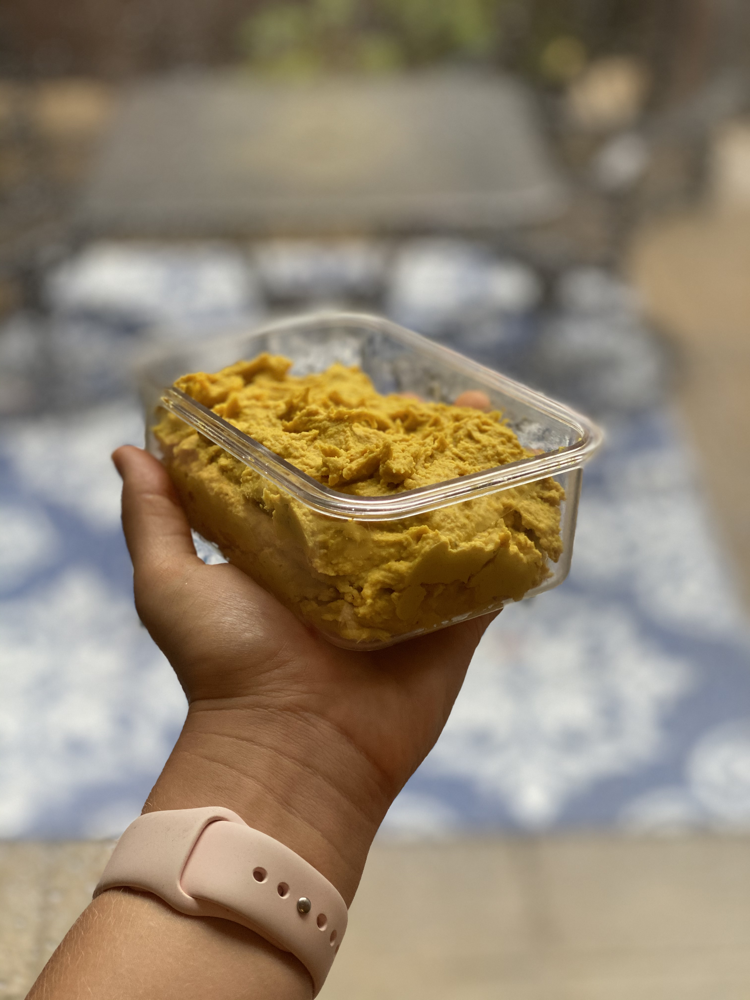
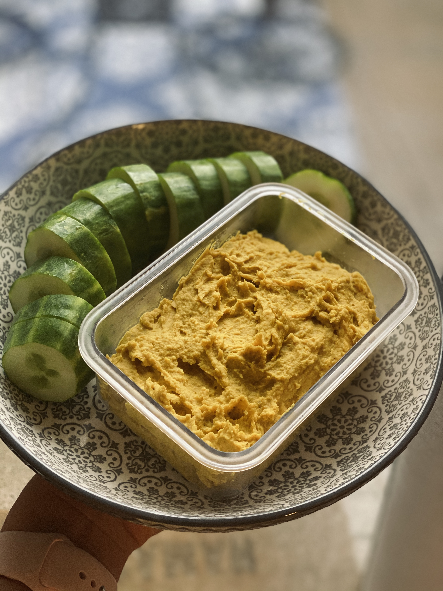

 

I’ve been waiting to share this one, but the time is finally here. 

I’m going to share my favourite hummus recipe with you!

 

I absolutely **LOVE** hummus.

 

It is my go-to for a nutritious snack.. 

The reason I reach for hummus first is that it is such a well-rounded snack. It contains Carbohydrates, Fats and Proteins. 

It pairs so well with fresh organic produce of every colour, plus nutrient-dense crackers or really any dippable ingredients.

 

Hummus contains protein and healthy fat (chickpeas, tahini) and veggies add fibre, vitamins, minerals and water. 

For a snack, I will have a handful or two of veggies with a few dollops of hummus.

 

**Pro Tip:** Cut up vegetables at the beginning of the week, to have for the week. I often do celery and carrots and add to a container with water.

 

Today, I’m going to share my...

 

 

##### GOLDEN HOUR HUMMUS

 

- - -

 

 

- - -

 

This hummus is awesome for so many reasons;

 

1. It is bold with flavour, making it a perfect match with fresh, raw veggies!
2. It has tons of anti-inflammatory ingredients (*ginger, turmeric, garlic*) making it a perfect addition for a snack to your busy, strenuous day!
3. It is super easy to make, just throw it all together!

 

 

- - -

 

## GOLDEN HOUR HUMMUS

 

10-minute golden hour hummus packed with anti-inflammatory ingredients! A well-rounded creamy, rich and protein-packed snack.

 

- - -

####  

 

- - -

##### Prep Time

10 minutes

##### Total Time

10 minutes

##### Servings

8 servings

- - -

 

**Ingredients:**

 

* 1 15-ounce can chickpeas, drained *(*or you can soak the equivalent dry amount overnight)*
* 1 medium lemon, juiced (~3 Tbsp or 45 ml as original recipe is written)
* 3 Tbsp tahini
* 2 cloves garlic (minced // plus more to taste)
* 1 tbsp apple cider vinegar
* 1 tsp fresh grated ginger
* 1/2 tsp fresh grated turmeric *(*or double the amount of ground turmeric if you have no fresh turmeric)*
* 1/4 tsp ground turmeric (*plus more to taste*)
* 1/4 tsp sea salt
* 1/4 tsp black pepper
* 1/4 tsp cayenne pepper (*optional*)
* 1-2 Tbsp olive oil (*or sub water*)

 

- - -

 

**Instructions:**

 

1. Add drained chickpeas, lemon juice, tahini, garlic, apple cider vinegar, ginger, fresh turmeric, ground turmeric, salt, black pepper, and cayenne (optional) to a food processor (*or a blender would work*) and blend on high until creamy and smooth, scraping down sides needed.
2. To create a more creamy hummus, add a bit of oil and/or (if avoiding oil) water. (*About 1 Tbsp oil and 2 Tbsp water*).
3. Taste and adjust flavour as needed, adding more of any of your favourite spices to taste. I added extra apple cider vinegar to give it more of a zing, and cayenne to make it nice and spicy!
4. Now you’re ready to dip any and everything into your Golden Hour Hummus!
5. Store leftovers covered in the refrigerator up to 3-4 days.

 

- - -

 

Enjoy this delicious Golden Hour Hummus!
 

Have fun creating, and tag me in your photos @rmdholistics on instagram!

 

\-Rachel xxx