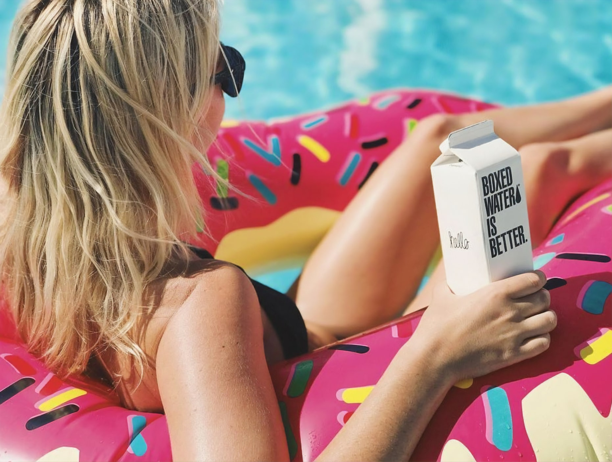
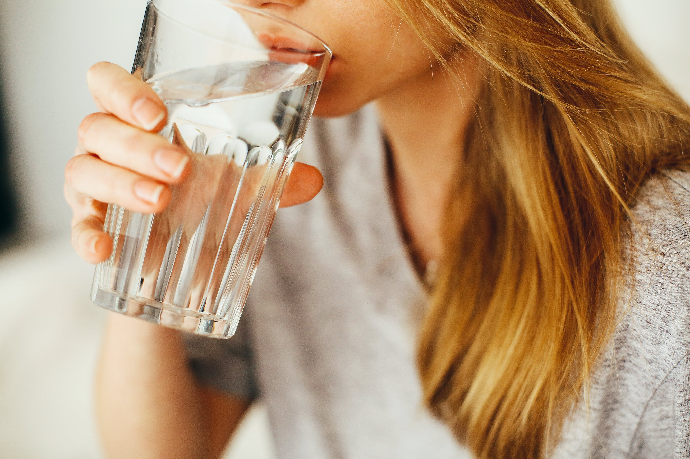

 

### **HOW MUCH WATER SHOULD I REALLY BE DRINKING?**

 

 

Most of us know that water is so important for our day to day life.

 

*“Drink eight glasses of water every day”…says every New Years resolution list ever.*

 

Is what we are told, but how many of us are sticking to this, and is it accurate?

 

It seems like an easy enough goal to attain, when in fact so many of us are letting this goal fall by the wayside.

 

We know we are made up of water, and that is essential for our survival. Proper water intake is key to healthy living, and we just aren’t getting enough, **nearly 75% of Canadians are not drinking enough water.**

 

What I have discovered is that we aren’t nearly as aware of how much we should be drinking, or why it is so important to be getting enough every day.

 

So I’m here to clarify a couple things today!

* *

Regardless of if you are a serious athlete, a fitness connoisseur, a dancer, a desk worker, or a regular high school student, hydration is the key to performance and recovery. Water helps **regulate body temperature, lubricates your impacted joints, and delivers essential nutrients and vitamins throughout the body** to be used, especially in exercise when our bodies require them the most.

 

Without proper hydration, you can experience a malfunctioning body including muscle fatigue, dizziness, headaches, reduced cognitive function, irregular mood swings, and cramping.

 

In other words…you will not be able to perform your best at any task without proper hydration.

 

- - -

 

#### HOW MUCH WATER SHOULD YOU DRINK EACH DAY?

 

- - -

 

 

 

We should be aiming to hit **one and a half to two litres of water each day!**

 

The best way to succeed at doing this is to keep a reusable water bottle on you each day. This way you can keep track of how many times it’s been filled, and in turn, how much water you are drinking.

 

For example, if you carry the classic 500mL bottle with you every day you know you need about 3-4 of those each day.

 

Now for all my athletes, gym-goers, dancers, and yogis!

 

It is true, exercise will require you to have more water throughout the day. This is because the body utilizes the water you have consumed to cool you down while you’ve been exercising, it has lubricated joints to prevent inflammation, and it has delivered essential nutrients to the body!

 

In order to be getting enough water while exercising, **for each hour of exercise you need to add and extra one litre** on top of the regular day to day quantity.

 

This means on a day that you exercise for an hour you should be having two and a half to three litres of water.

 

- - -

 

#### DOES THE TYPE OF WATER YOU ARE DRINKING MAKE A DIFFERENCE?

 

- - -

 

 

 

The short answer to this question is - **YES!**

 

Where you get your water from matters a great deal.

 

Often tap water has been processed with chemicals like fluoride, and chlorine, as well as the natural minerals in the water, have been taken out.

 

We want to make sure we are hydrating ourselves with the highest quality of filtered water, and we also want to make sure that we are re-mineralizing the water to keep our trace mineral content at a level that will prove beneficial to our body’s systems.

 

In order to accomplish this, you want to get a trusted source of water. There are so many options for this including in-home filtration systems, on the counter filtration, and specialized equipment you can add into your water bottle to filter on the spot.

 

After a lot of research, I have personally invested in a Berkey Filter. I have also purchased re-mineralizing stones that will put back the good minerals that are taken out throughout the filtration process to help keep my mineral content up.

 

It has made a huge difference for me in terms of **healthier skin, better digestion, and more natural energy**.

 

There are a lot of really great and trusted brands on the market, if you find one of interest, feel free to reach out and ask me about it! I’ve definitely done my research!

 

- - -

 

#### DOES TEA AND COFFEE COUNT AS WATER INTAKE?

 

- - -

 

 

 

I know what you want me to say… but the truth is, no!

 

Coffee and tea do not count as water intake. **insert crying emoji*

 

Even though these things are made up of water, the liquid we are giving ourselves is not water at all. We need pure, unchanged water to hydrate ourselves in the best possible way.

 

If plain water is not your thing, there are a lot of **alternative options**;

 

1. **Add Fruit to your water**
    
   *A little bit of cucumber, berries, mint or lemon can make the world of a difference in helping you consume the proper amount of water.*

 

2. **Add trace mineral supplements**
    
   *There are a lot of great trace mineral supplements that you can add into your water on the market. They are as easy as adding 10 drops into your water bottle!*

 

3. **Add Hydration Supplements**
    
   *Just like with the trace minerals the hydration supplements are going to be rich in vitamins and minerals, as well as boost the flavour of the drink.*

 

- - -

 

Be careful that you are not adding unnecessary sweetener into your water, read the label and search for something with low to no sugar. I really like NUUN for hydration, they have lots of options with no sugar as well!

 

Drink Up, Everyone!

 

\-Rachel xxx