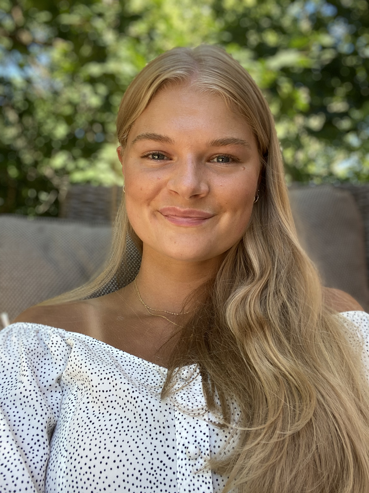

 

Hey Everyone! 

 

 

Welcome to my Blog! 

I'm so excited you're here.  

 

I was thinking long and hard about what my first blog post should be, and I figured what better way to start this blogging journey with a little meet and greet of the person on the other side of these key strokes...ME! 

 

 

 

 

My name is Rachel McDonald. 

 

I am a Certified Nutritional Practitioner (CNP), Professional Dancer, a Dance Instructor, and Choreographer. 

 

For as long as I can remember I have been interested in all things health and wellness. I was really lucky growing up with my three siblings. My mom has passed down a deep passion for keeping us all healthy (which by the way - was no easy feat). We were the kids that went to school with Chlorophyll water, or swamp water, as the kids used to call it. I can say I didn't realize how much of an impact this had made on me at the time, and how it would later impact the rest of my life.

 

Just like with health and wellness, dance has been a part of my life for a very very long time. I was lucky enough to be enrolled as just a wee munchkin. I fell in love early with the difficulty of the sport, but also how the actual level of difficulty was always masked by this beautiful graceful movement. 

I danced all throughout my school years, and dance provided me with so many life skills and experiences. I learned so much about myself in these years. My level of dedication to myself to improve but also the level of discipline to continue working with my team to improve as a whole. 

 

I loved dance so much I wasn't ready to give it up at the end of highschool. I decided instead to continue training and enrolled in a Professional Intense Dance Training program. This intense program is when I began to experience digestive issues. I would curl up into a little ball with intense abdominal pain! With no clear answer, I tried to eliminate some known allergens. I noticed an immediate improvement in heightened energy levels and an overall stronger body. This allowed me to push my body technically and physically which took my performance to the next level.

 

From there my passion for nutrition took the centre stage. I decided to attend The Institute of Holistic Nutrition where I would deep dive into all things health-related. I graduated and gained my Certified Nutritional Practitioner Certification (CNP, Hons.)

 

