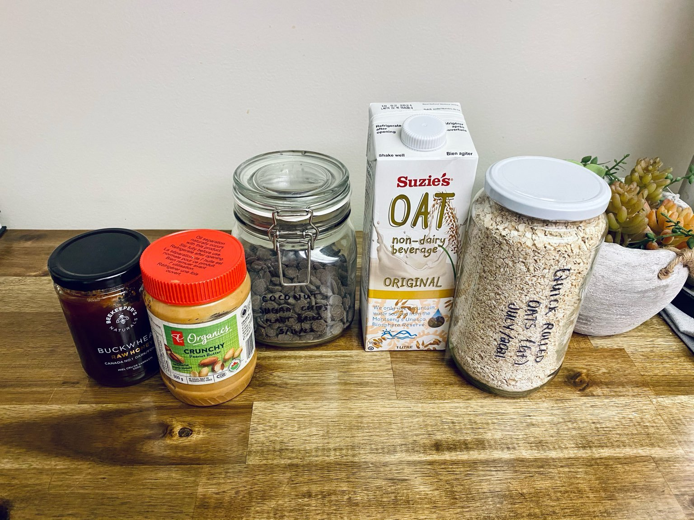
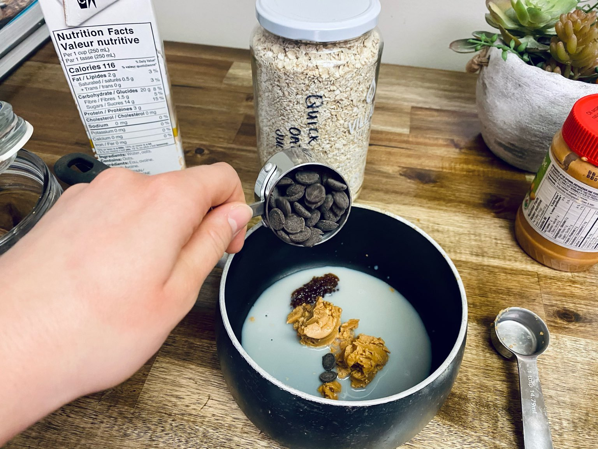
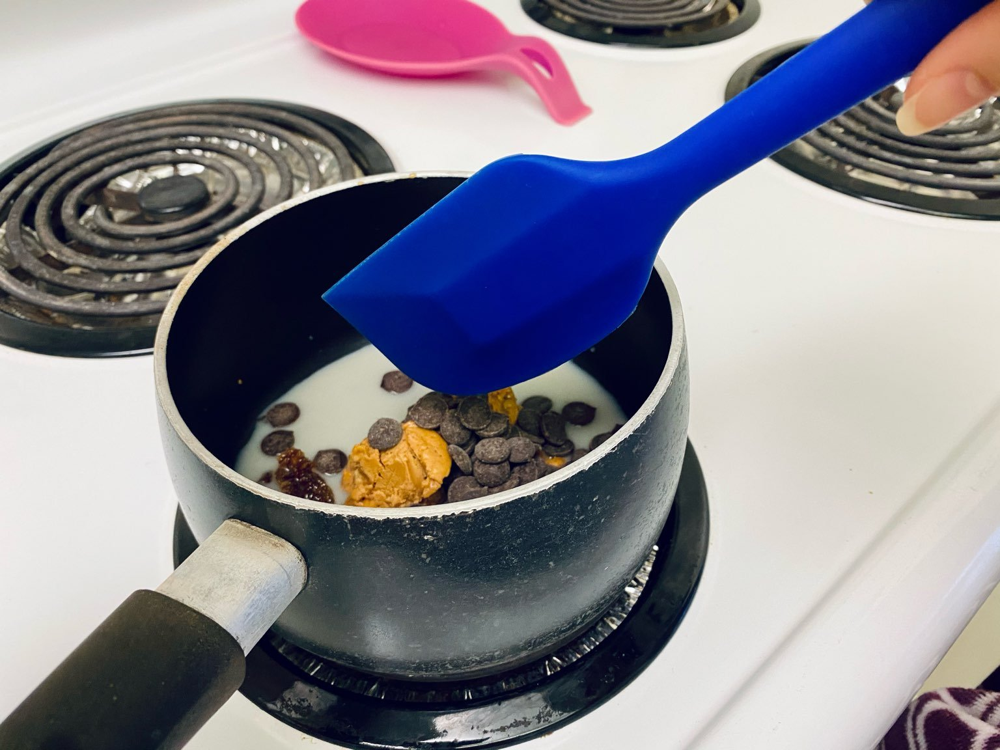
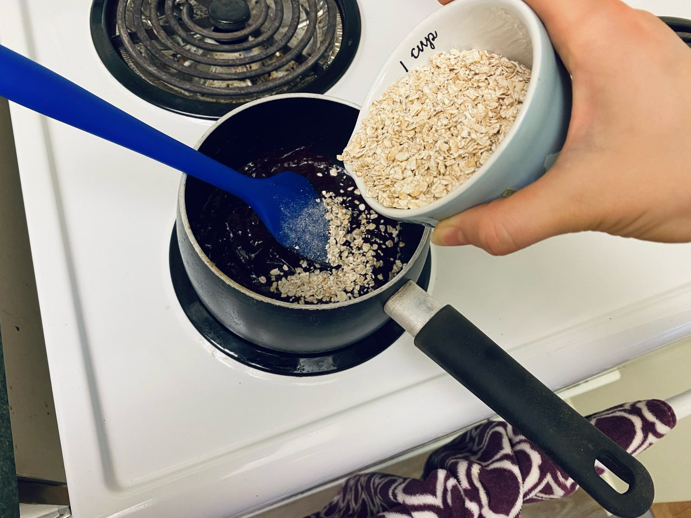
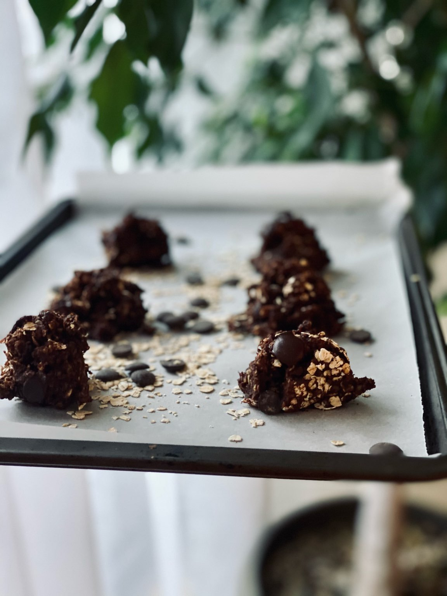

 

- - -

 

### NUT BUTTER & CHOCOLATE OAT BITES

 

- - -

 

I know we are in some strange times, but **I feel busier than ever**…anyone else?
 
I’ve been experimenting with higher protein snacks that will keep me feeling more sustained for longer while giving me enough of an energy burst to make it through these busy days. 
 
 

 

- - -

 

##### Over Snacking and Protein

 

- - -

 

Do you ever eat a snack, a treat, a meal and not even feel slightly satiated? 
 

This happens to me…more often than I’d like to admit. Then what tends to happen is I end up eating too much empty food, which doesn't make me feel full, energized, and ready to face a busy day.

 

I started thinking, why is this happening, and what can I do about it?

 

Then it dawned on me. My snacks that were supposed to take me from meal to meal were missing something that would keep me feeling far more sustained and energetic.

 

- - -

 

###### PROTEIN!

 

- - -

 

I know as a plant-based eater that **protein is important**, and I focus on getting adequate protein at mealtimes, but I was forgetting about the importance of protein in snacks as well. 

 

**I want to snack smart, and not snack mindlessly**, which I think is a goal for most of us. Eating less often but eating enough smart foods to keep my mental and physical levels high without crashing mid-day. **Protein will aid in helping you feel full longer, as well as stabilize blood sugar levels to prevent a quick rise and fast fall, unlike a lot of other foods.**

 

Today, I’m going to share a wonderfully quick and easy recipe that will provide a good amount of protein, all while being a tasty treat that fuels my day. 

 

- - -

 

### NUT BUTTER & CHOCOLATE OAT BITES

 

- - -

 

**Prep Time**: 5 minutes
 
**Cook Time**:  5 minutes
 
**Total Time**: 10 minutes
 
**Makes**: 12 bites
 

 

- - -

 

###### Ingredients:

 

- - -

 

 

- - -

 

•	4 tbsp Nut Butter (peanut, cashew, blends) *I really like a nut butter blend that has chia seeds inside
 
•	4 tbsp Plant-based Milk* I really like Oat Milk
 
•	½ cup Chocolate Chips *I really like refined-sugar free alternatives, like Coconut Sugar
 
•	2 tbsp Hemp Heart
 
•	1 tsp Cinnamon
 
•	1 ½ cup Old Fashion Rolled Oats*  I use Gluten-Free Oats
 
•	Additional Option: Add 1 tbsp of raw honey to make these slightly sweeter!

 

---

 

- - -

 

###### Directions:

 

- - -

 

 

---

 

1. Add Nut Butters, Plant-based Milk, Chocolate Chips (*optionally add in honey), to a sauce pan. Cook over low heat until chips melt, and the mixture becomes smooth. 
    
2. Stir in Oats, Hemp Hearts, and Cinnamon, remove from heat.
     
3. With a spoon, or mellon baller, make 12 bite size Nut Butter Chocolate Oat Clusters. 
    
4. Let sit in the fridge for 10 minutes before serving.
     
5. Store in the fridge for up to 5 days. 

 

---

 

- - -

 

---

 

 

---

 

Try these little protein bites and let me know what you think. 
Hopefully they make your busy days a little bit more sustainable. 

 

Enjoy staying fueled with me. 

 

\-R