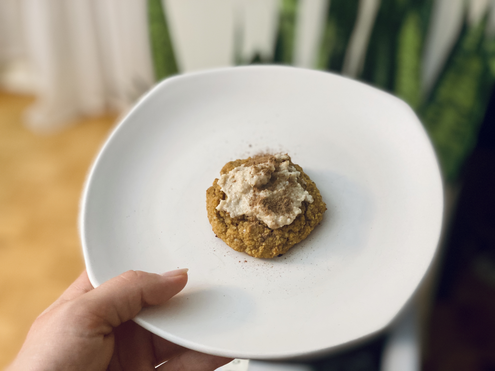
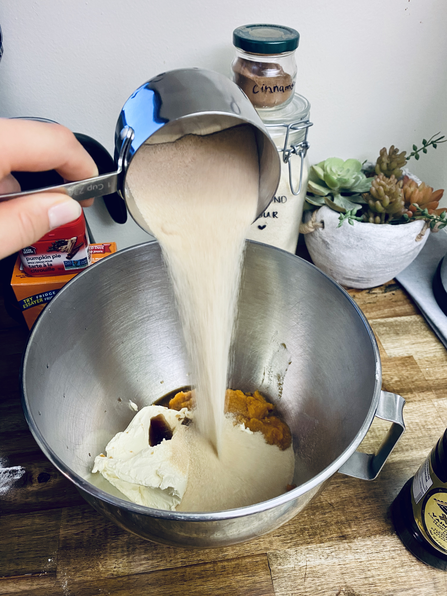
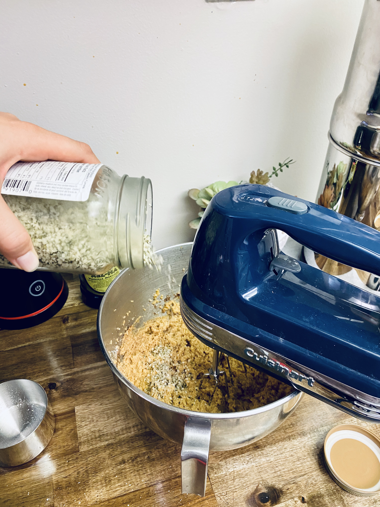
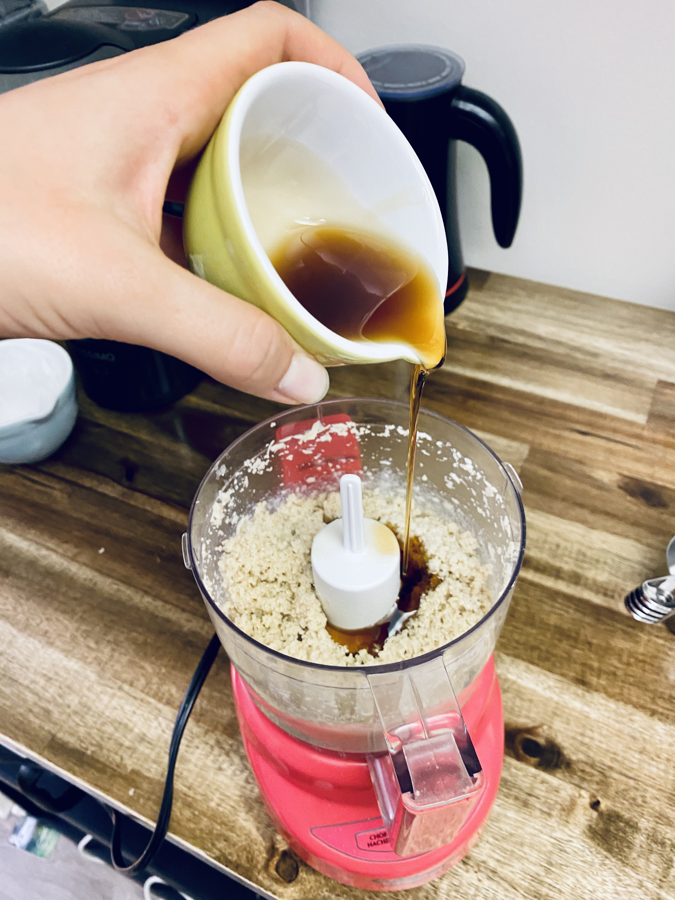
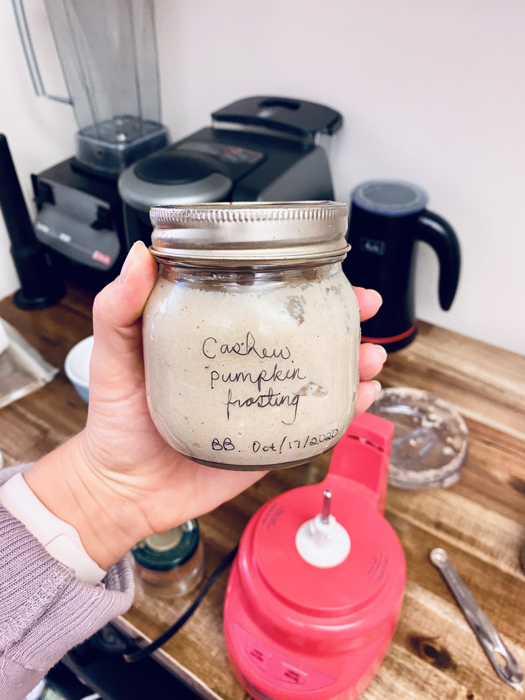

<!--StartFragment-->

 

- - -

 

# PUMPKIN PIE COOKIE ROLLS

 

- - -

 

 

‘Tis the season for everything **Pumpkin**.

 

Just like the majority of us, I’m a huge Pumpkin sucker.

 

I’m a huge sucker for any sweet dessert that includes Pumpkin.

I love it so much that I once had Pumpkin Pie for my birthday because **I’m so obsessed**.

 

- - -

 

If you saw my last blog post…

 

Click here to check it out

 

<https://rmdholistics.com/stress-sugar-cravings/>

 

 

I **LOVE** dessert but I don’t like the common side effects that go along with a lot of refined sugars and an overdose on sweets.

 

- - -

 

**First of all…**

 

**Sugar is incredibly addictive.** Once you get on a loop of having lots of sugar, your body craves it more, which in turn makes you consume it more often. It is a very dangerous track to be on.

 

**Secondly…**

 

**Sugar decreases the body’s immune system functions!** Sugar suppresses the immune system from doing its job in protecting you, instead, it distracts the immune system opening you up to be vulnerable for pathogens, bacteria, or worse to infiltrate your system.

 

**Finally...**

 

**Sugar increases stress.** Yes, we all know when we are stressed we often turn to sugar. This is because the taste of the sweet treat helps to release a “happy” hormone. However, it also releases the fight or flight hormones known as cortisol, adrenaline, and epinephrine. These are released to give us energy, however, they also leave the body and mind feeling more anxious, irritable, and shaky.

 

None of which we want to experience when we are already feeling stressed out.

 

 

There are a lot more reasons why sugar can be harmful to the body, which I know is sad because who doesn’t love a sweet treat every once in a while.

 

It is for this reason that I like to create and find recipes that include **Refined Sugar-Free Treats**.

**These curb that sweet craving** without s**piking blood sugar**, **decreasing immunity**, or **leading me to become more addicted to sugar and sweets.**

 

Since it is fall, after all, I thought I would create a lovely pumpkin dessert that curbs any craving but also gives a healthy quantity of fat, and protein to help slow the release of the unrefined sugars without sacrificing any flavour.

 

 

- - -

 

## PUMPKIN PIE COOKIE ROLLS

 

- - -

 

 

 

- - -

 

#### Cookies

 

- - -

 

Prep Time: 10 Mins

 Cook Time: 10 Mins

 Total Time: 10 Mins

 Makes: 9 Cookies

 

- - -

 

*Gluten free, Paleo, Refined Sugar Free*

 

- - -

 

##### Ingredients

 

- - -

 

* ½ cup Pumpkin Puree
* ¼ cup Vegan Butter (or coconut oil)
* 1 tsp Vanilla Extract
* ½ cup Coconut Sugar (or monk fruit extract)
* 1 Egg
* 1 ½ cup Blanched Almond Flour
* ¼ cup Hemp Hearts
* 1 tsp Baking Soda
* ½ tsp Sea Salt
* ½ tsp Pumpkin Pie Spice (I like to use a heavy hand with this)
* ½ tsp Cinnamon

 

- - -

 

##### Directions

 

- - -

 

1. Preheat Oven to 350 F
2. Use an electric mixer to blend the Pumpkin puree, Vanilla, Coconut Sugar, Hemp Hearts, and Egg.
3. Once combined, add the Almond Flour, Baking soda, Sea Salt, Pumpkin pie spice, and Cinnamon.
4. Continue to mix with a handheld mixer until well combined.
5. Use an ice cream scoop to create some medium-sized dough balls onto the baking sheet.
6. Dampen fingers and gently press down to flatten the tops of the cookies.
7. Bake for 10-12 minutes.
8. Allow to cool completely before transferring to a cooling rack.
9. Make Icing while they cook.

 

 

 

 

 

 

 

 

 

 

- - -

 

#### Icing

 

- - -

 

Prep Time: 15 Mins

Total Time: 15 Mins

Makes: 2 cups

 

- - -

 

*Vegan cream cheese frosting made with raw cashews*

 

- - -

 

##### Ingredients:

 

- - -

 

* 2 cups Raw Cashews (Soaked Overnight)
* 1/3 cup + 1 tbsp Pure Maple Syrup
* 2 tbsp Fresh Lemon Juice
* ¼ cup unsweetened Oat Milk
* 1 tsp Pure Vanilla
* 1/8 tsp Sea Salt

 

- - -

 

##### Directions:

 

- - -

 

1. Soak the Cashews overnight or for at least 3 hours. Drain Cashews and pat to dry.
2. Add the Cashews to a food processor and process until thick paste forms, scrape down the sides until well processed.
3. Leaving the food processor running add the Maply Syrup, Lemon Juice and Oat Milk. Add the Vanilla, and Sea Salt. Continue blending until well combined. Taste and add more lemon, maple syrup if desired, or milk to thin.
   Transfer to a container and keep sealed in the fridge for up to 1 week.

 

 

 

 

 

 

- - -

 

 

I love Pumpkin!

 

Try this recipe and let me know if you love it as much as I do!

 

\-R