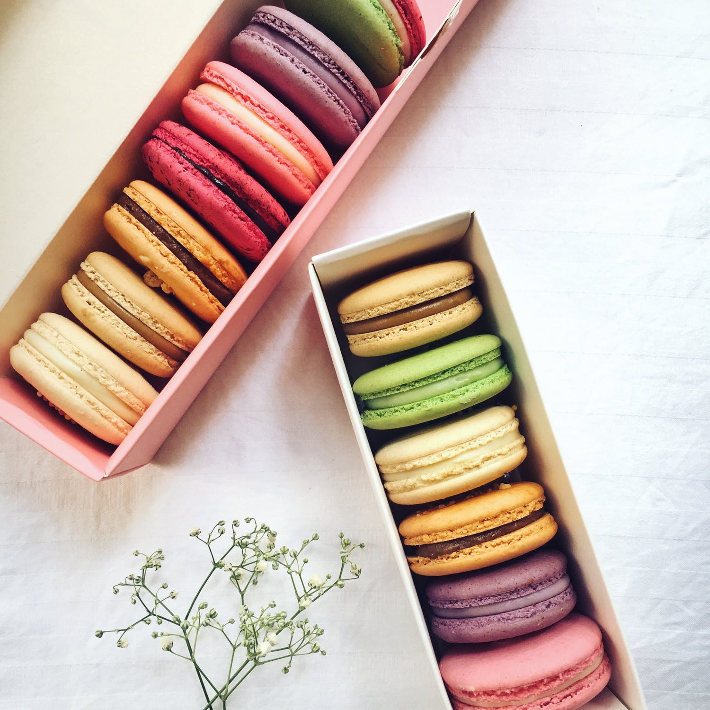

 

- - -

 

# STRESS AND SUGAR

 

- - -

 

I can’t tell you how many times I’ve had people mention the correlation between stress and sugar to me… **“I am craving all the sweets this week!”**
 
So, I follow with a **“Are you stressed out?”**
 
The answer is almost always… **“YES!”**

 

Why would that be? 

 

Why do we crave sugar when we’re stressed? 

 
I have a three-part answer for you!

 

 

- - -

 

 

- - -

 

### SUGAR MAKES US FEEL GOOD

 
Science literally says so…

 

 

- - -

 

We all know that good feeling when you first bite into something sweet. No, you’re not dreaming, that sweet treat gives you a genuine happy boost with the help of the **neurotransmitter, Serotonin**. 

 

**Serotonin is the Happy Hormone**. It is responsible for regulating anxiety, happiness, and mood. So, it’s no wonder why your body craves sweets. It is in search of some **Serotonin, to help you manage your stress**. Low levels of Serotonin can be linked with depression and anxiety. It is also an important component of sleep, which is in high demand when under great deals of stress.

 

When we eat something sweet, we get a burst of insulin. This release causes the reaction to be our amino acids moving into our muscles, except for one, **Tryptophan**.

 

**Tryptophan is a precursor of Serotonin**. Once all the other amino acids are sent into the muscles, Tryptophan is left to make as much Serotonin as it can. 

 

The sweeter the treat, the higher the Serotonin boost…

 

But also...bigger the fall.

 

The bigger the fall, the stronger the craving, and that my friends, is a hard ride to just step off of. 

 

 

Finding treats that contain no refined sugar and fiber is the best way to balance blood sugars to prevent that Insulin spike that makes it so hard to stop craving those sweets. 

 

**You will still get that nice boost, without the crash that follows!**
 

 

- - -

 

### THE MOST COMMON CRAVING (CHOCOLATE…YUM) IS HIGH IS MAGNESIUM

 

- - -

 

Raise your hand if you crave chocolate when you’re stressed!

 
\\\\*\\\\*\\\\*raises all limbs\\\\*\\\\*\\\\*

 

So many people crave chocolate when under stress. Not everyone, but it is very common. Nutritionally this makes complete sense as to why your body would be craving some chocolate on a, particularly stressful day. 

 

Chocolate, now I’m talking the good, unrefined, dairy-free chocolate. (I’m talking dark chocolate, cocoa, and raw cacao). These varieties are high in, you guessed it…Magnesium!

 

Now, before we continue, I’ve already done a Blog Post on all the wonder that is Magnesium, so check it out here…

 

<https://rachelsblog-test.netlify.app/magnesium-all-its-glory/>

 

We burn through Magnesium really fast when we’re stressed which is why our bodies crave chocolate. 

 

See how smart your body is? It knows exactly what it’s looking for!

 

How cool is that??

 

 

- - -

 

### SWEETS GIVE US JOY

 

- - -

 

Sometimes when we have a very stressful day (or week, or month, or year) our body just wants a bit of joy, just straight-up joy. And that is not a bad thing!
 

Food can be so joyful, and make us so happy, but guilt can steal any good feeling food is trying to give us.
 

Eating with no guilt can be difficult, but remember…

 

**Everything in Moderation.** 
 
Indulge, and enjoy it, but don’t overdo it. 

 

I certainly know and am quite good at indulging. I love treats, I have too many favourites to list. 
 

In order to not overdo it, I will only make enough for me to have a bit, without having the whole thing.
 

This way I get to enjoy, without feeling bad about it. It has really worked for me, as I settle into to knowing I really do love to have my treats. 

 

**Balance is the name of the game.** These sweet treats bring me joy, but knowing they have no refined sugar, and I am having a serving, and not six servings, (Been there, done that) certainly helps!

 

- - -

 

### HOW TO BALANCE YOUR SUGAR CRAVINGS

 

- - -

 

* **Understand that your body is smart, and these cravings are because your body is in search of something.** 
   
  Your body is asking for help, and by giving it what it is asking for, knowing how to accomplish it in the best way (refined sugar-free), will benefit your body!

 

* **Treat Yo’ Self.** 
   
  Simple as that. You deserve a treat, so have a treat. There is an insane amount incredible recipe for healthy sweet treats. I also heard from a little birdy that the next post for this blog is a healthy dessert recipe…keep your eyes peeled!
* **Enjoy your treat!**
   
  Find the joy in your treat and embrace it fully! I certainly excel at doing this portion right here! 

 

 

- - -

 

Stress is normal, especially in todays world. 
 

Learning how to cope while still giving yourself the balance of treats and down time is crucial! 

 

Stay tuned for some incredible healthy dessert recipes to come.
 

In the meantime, go…

 
 \\*\\*TREAT YO’ SELF!\\*\\*

 

\-RM